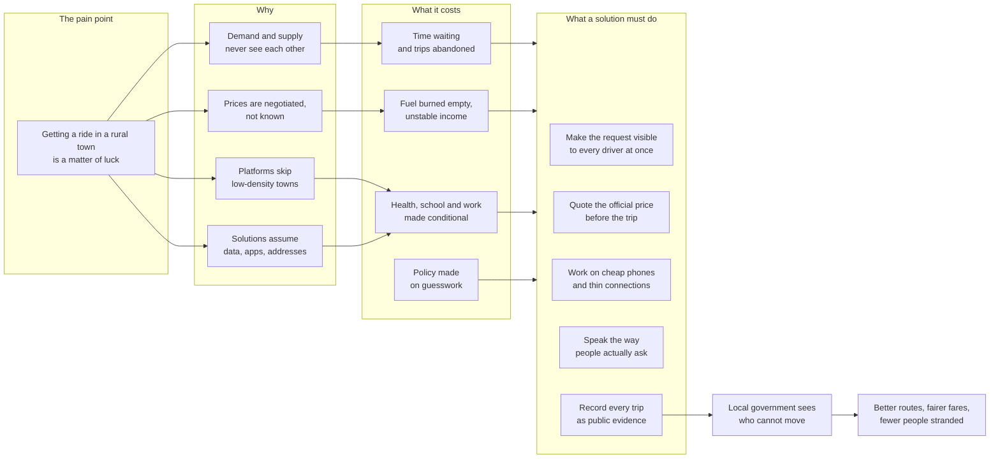
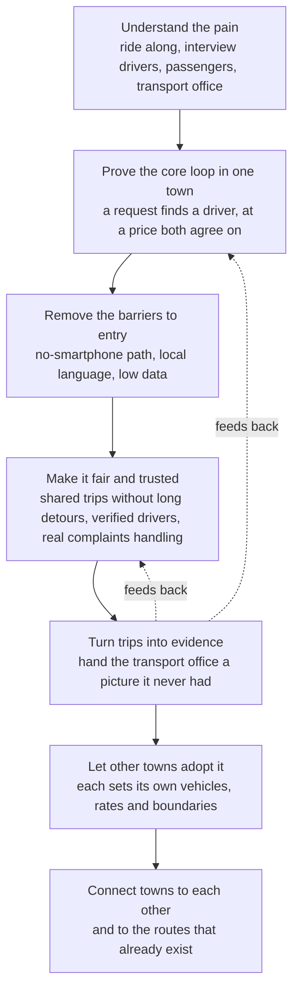

# Intelligent Rural Transportation Access — Problem Map

Conceptual map for the hackathon entry. The centre is the pain point, not the
product. Everything else hangs off it: who feels it, why it happens, what it
costs, and only then what a solution would have to do.

Paste any block into <https://mermaid.live> to render or export.

---

## 1. The pain point at the centre

```mermaid
mindmap
  root((PAIN POINT - In rural towns, getting a ride is a matter of luck))
    WHO FEELS IT
      Passengers
        Wait at the roadside with no idea if a ride is coming
        Pay whatever price is asked, no reference to go by
        Stranded after dark, in rain, on holidays
        Elderly and PWD give up on trips entirely
        Students miss classes, workers arrive late
        Patients delay clinic visits over transport uncertainty
        Women travelling alone have no record of who drove them
      Drivers
        Circle empty, burning fuel to find passengers
        Income swings wildly day to day
        Whoever shouts loudest or waits longest wins, not whoever is fairest
        No way to be found by someone two barangays away
        Blamed for overcharging with no way to prove otherwise
      Local government
        Plans routes and franchises with no trip data
        Cannot tell which barangays are underserved
        Fare complaints are word against word
        No record of driver conduct or repeat offenders
      The community
        Barangays off the main road stay economically cut off
        Small businesses lose customers who cannot get there
        Tourists stay near the terminal and spend less
        Emergency and night travel is a private favour, not a service
    WHY IT HAPPENS - ROOT CAUSES
      No shared source of truth
        Demand and supply never see each other
        Rides are matched by chance encounter
        Published fares exist on paper, not in practice
      The market ignores these places
        Ride-hailing platforms chase dense metro demand
        Local vehicle types are not even a category to them
        Low ride volume looks unprofitable from a boardroom
      Local realities break imported solutions
        Costly or intermittent mobile data
        Shared and low-end phones
        Places without formal addresses
        Trust runs on personal familiarity, not accounts
      Informal by tradition
        Terminals run on verbal queues and barkers
        Agreements are spoken, nothing is recorded
        Nobody owns the coordination problem
    WHAT IT COSTS
      Time lost
        Hours of waiting that nobody counts
        Trips abandoned before they are attempted
      Money lost
        Fuel burned driving empty
        Fares above the legal rate
        Earnings that cannot be planned around
      Access denied
        Health, school and work made conditional on luck
        Mobility poverty concentrated on those with the fewest options
      Opportunity lost
        Local commerce capped by who can physically arrive
        Policy decisions made on guesswork
      Environmental cost
        Empty kilometres and idling
        Several near-empty vehicles on the same road at the same time
    WHAT A SOLUTION MUST DO
      Make demand and supply visible to each other
        A request reaches every available driver at once
        A passenger can see that help is actually coming
      Make the price knowable before the trip
        Quote the official rate up front
        The same number for passenger and driver
      Fit the vehicles people really ride
        Whatever the town runs, not sedans
      Work where the internet barely does
        Usable on a cheap phone
        A path in for people with no app at all
        Nobody excluded for lacking a smartphone
      Be usable by someone who has never used an app
        Ask in plain language, in the local language
        Guidance instead of forms
      Fill the seats already going that way
        Share rides without making anyone's trip unreasonably long
      Earn trust
        Verified drivers, traceable trips
        Complaints that lead somewhere
      Turn every trip into evidence
        Show local government where demand actually is
        Make underserved areas visible
      Belong to the town
        Local ownership of the data and the earnings
        Adaptable to each town's own rules and rates
    WHERE THE AI EARNS ITS PLACE
      Understand a request as a person phrases it
        Landmarks and local place names, not coordinates
        The local language, spoken or typed
      Decide who gets which ride, fairly and instantly
        Match the nearest willing driver
        Combine trips heading the same way
        Notice when a request is going unanswered and say so
      Answer the questions people actually have
        How much will this cost
        How long will it take
        Is there anything running at this hour
      Learn the town over time
        When and where demand appears
        Where drivers should wait
        How long trips really take on these roads
      Watch for what is going wrong
        Fares out of line
        Repeat complaints against the same driver
        Routes nobody serves
    HOW WE KNOW IT WORKS
      Waiting time drops
      Fewer trips abandoned
      Empty running kilometres fall
      Driver income becomes steadier
      Fare disputes decline
      Previously unserved barangays start appearing in trip records
      Local government makes a decision using the data
    HOW FAR IT REACHES
      One city proves it
      Any town adopts it by setting its own rules and rates
      Neighbouring towns connect, trips cross boundaries
      Feeds into existing routes rather than competing with them
      Province-wide picture of who can and cannot move
```

---

## 2. From pain to response

---

## 3. Conceptual roadmap

---

## 4. The problem statement, in three sentences

In rural towns and small cities, catching a ride is left to chance: passengers
wait without knowing if anything is coming, drivers burn fuel looking for
passengers who are standing a street away, and prices are settled by
negotiation rather than by the published rate. The cost lands hardest on the
people with the fewest alternatives — the elderly, students, patients, and
anyone travelling at night — while the local government that is supposed to fix
it has no data on where the gaps are. Solving this needs a coordination layer
built for how these places actually work: local vehicles, local language, cheap
phones, weak signal, and the town keeping ownership of what the system learns.
