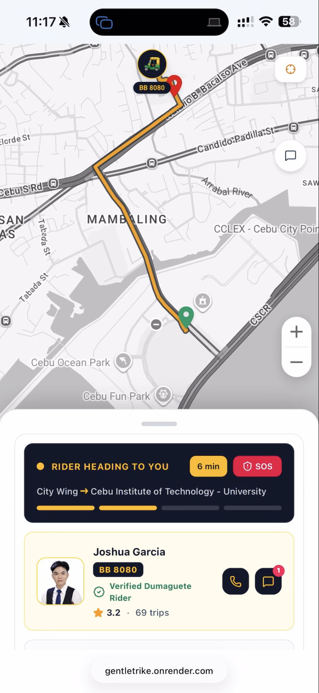
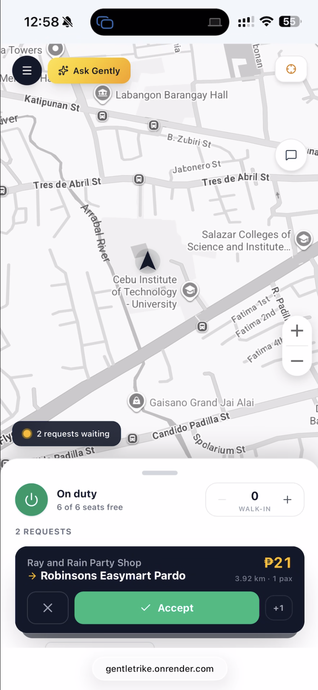
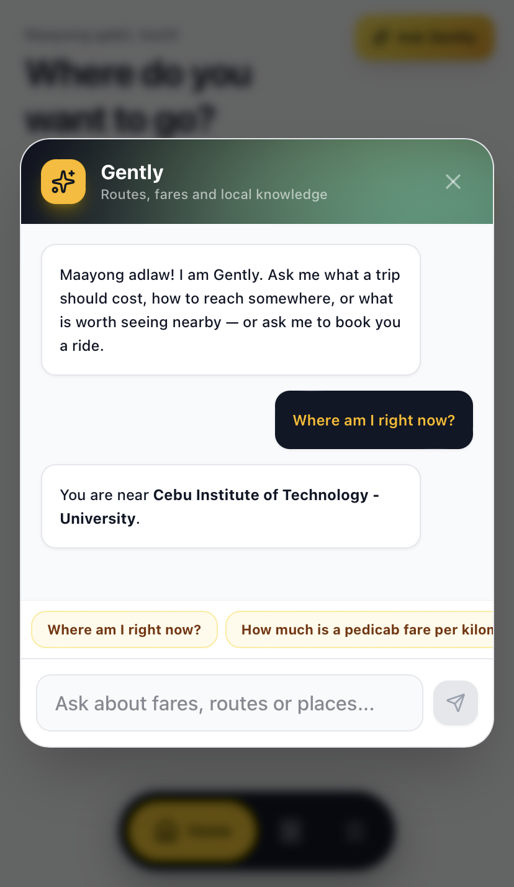
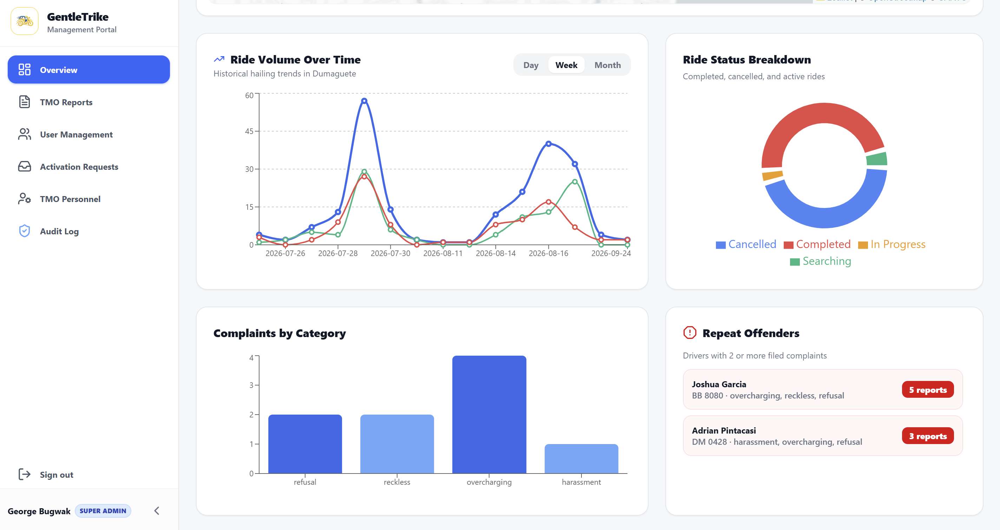
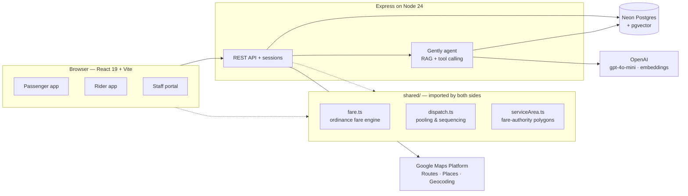

<div align="center">


# GentleTrike

**Real-time pedicab hailing and ride-pooling for Philippine towns — fair fares, findable rides, full seats.**

[](https://gentletrike.onrender.com)


</div>

<table align="center">
  <tr>
    <td align="center"></td>
    <td align="center"></td>
    <td align="center"></td>
  </tr>
  <tr>
    <td align="center"><sub><b>Passenger</b> — live rider tracking</sub></td>
    <td align="center"><sub><b>Rider</b> — detour-ranked request queue</sub></td>
    <td align="center"><sub><b>Gently</b> — AI trip guide</sub></td>
  </tr>
</table>

<p align="center">
  <br/>
  <sub><b>Staff portal</b> — ride analytics, complaints and repeat-offender tracking</sub>
</p>


---

## The Problem

In Dumaguete City, like much of the provincial Philippines, the pedicab (a
motorcycle with a passenger sidecar) is everyday public transport. It has no
fixed route and no meter:

- **Passengers** wait by the road with no idea whether a ride is coming, and pay
  whatever is asked. Official fares exist in a city ordinance, but few people
  know them.
- **Drivers** burn fuel circling for passengers who may be standing a street
  away.
- **The local transport office** has no data on demand, complaints or driver
  conduct.

Ride-hailing apps built for metro cities do not fit. They assign one car to one
booking, while a pedicab picks up several people heading roughly the same way.

## The Solution

GentleTrike is a coordination layer built around how pedicabs actually work:

| | |
|---|---|
| **Fair** | Every fare comes from one ordinance-exact calculation, shown up front and identical on the passenger's and the rider's screen. |
| **Findable** | A request reaches every nearby on-duty rider at once, and both sides follow the trip live on a map. |
| **Full** | Riders pool passengers going the same way. Each new request is ranked by the extra distance it would add to the route the rider is already driving. |

---

## Features

### For passengers
- Book any place by name, landmark or map pin. Search understands local
  shorthand like "SM" or "CIT-U".
- Upfront fare with distance, per passenger, or hire the whole trike as a
  **pakyaw** charter.
- Live rider tracking, in-trip chat, post-trip rating, and a one-tap complaint
  report to the transport office.
- **Gently**, an AI guide that answers "how much to…?", "where am I?" and local
  questions, and can prepare a booking for the passenger to confirm.

### For riders
- A heading-up map and a large-type UI designed for a glance at a phone mounted
  on handlebars.
- A live request queue ranked by detour, with "on the way" badges and optimised
  stop ordering.
- Seat management, including passengers picked up off the app, so the rider is
  never offered more people than they can seat.
- Earnings and trip history.

### For the transport office (staff portal)
- Rider verification: new riders cannot go on duty until approved.
- A complaint queue with automatic categorisation and repeat-offender tracking.
- Live rider map, ride-volume analytics, demand-by-hour statistics, and rider
  risk scores.
- Account moderation (suspend, ban, appeals) with a full audit log. Accounts
  that cancel or decline excessively are suspended automatically.

---

## Architecture



The key structural decision is the **`shared/` folder**. The fare engine,
dispatch logic and service-area rules are imported by both the browser and the
server. The price a passenger sees, the price a rider sees, and the price the AI
quotes all come from the same function, so they cannot disagree.

---

## Engineering Highlights

<details>
<summary><b>Detour-based pooling rather than nearest-driver matching</b></summary>

<br/>

The dispatch engine does not ask *"how far is this passenger?"* but *"how much
further do I drive if I take them too?"* For every waiting request it tries each
position in the rider's current stop list for the new pickup and drop-off,
always with pickup before drop-off, and measures the added distance. The
queue is sorted by that detour. Trips under 0.8 km get an "on the way" badge,
and only trips going the wrong way (a detour over 3 km) are hidden.

Riders pooling several passengers get their stops ordered by exhaustive search
up to 8 stops, and by greedy nearest-next above that. To keep pooling fair, a
passenger already aboard can never have their own ride stretched beyond **1.3×**
what they booked.

The logic is pure functions with no database or network, which makes it fully
testable offline.
</details>

<details>
<summary><b>An ordinance-exact fare engine</b></summary>

<br/>

The city ordinance charges a base fare for the first kilometre, then each
*"succeeding kilometre **or fraction thereof**"* in full. The engine rounds the
remainder up and subtracts a tiny epsilon (`1e-9`) first. Without it, a trip of
exactly 2.000 km could round up to an extra kilometre because of floating-point
error. The fare table is designed so each local government can plug in its own
official rates.
</details>

<details>
<summary><b>An AI assistant that computes nothing itself</b></summary>

<br/>

Gently is a Retrieval-Augmented Generation (RAG) agent over a knowledge base of
~2,400 embedded chunks, stored in pgvector beside the ride data. Its design
rule: **the system computes, the model proposes, the human commits.**

- **Fares come from code, never the model.** The `estimate_fare` tool calls the
  same fare engine as the booking screen.
- **It cannot book.** `draft_booking` returns a summary card that the passenger
  must tap to confirm. The server takes identity from the session, never from
  the model.
- **Trust tiers are enforced in SQL.** An old travel wiki quoted a ₱9 fare; the
  real rate is ₱15. On fare questions, low-trust sources are filtered out in the
  `WHERE` clause, so the model never sees them. Cebuano and Tagalog price words
  (*tagpila*, *magkano*) are recognised when classifying questions.
- **Recency matters.** Older chunks carry an age penalty in ranking, so a stale
  ferry schedule doesn't outrank a current one.
- **It asks when unsure.** When a place name is ambiguous, Gently asks which one
  the passenger means rather than silently picking one.
- **Every test runs free.** A mock LLM provider implements the same interface,
  so the whole agent loop is tested without API calls. Total AI spend during
  development was about $0.04.
</details>

<details>
<summary><b>Race-safe, multi-user trip lifecycle</b></summary>

<br/>

Accepting a ride is a conditional update, so when two riders tap Accept at the
same moment, one wins and the other gets a clean conflict. The server checks
seat capacity across all of a rider's active trips, and a pakyaw charter blocks
pooling in both directions. A decline hides a trip from that rider for 10
minutes rather than forever, so a request cannot become invisible to everyone
while the passenger is still waiting.
</details>

<details>
<summary><b>Location that behaves on real phones</b></summary>

<br/>

A fast, rough location fix opens the map in the right city at once, while a
high-accuracy fix refines it. The rider's map rotates with the phone's compass.
Looking up where you are standing and naming a spot you tapped use different
rules: standing inside a mall, "where am I" names the shop you are in, while a
tap on the mall names the mall. A `?at=` URL override simulates any location,
for testing a city you are not in.
</details>

---

## Tech Stack

| Layer | Technology |
|---|---|
| Frontend | React 19, TypeScript, Vite, Tailwind CSS v4, Google Maps JS (vector maps, advanced markers), Recharts |
| Backend | Node.js 24, Express 4, TypeScript |
| Database | Neon serverless Postgres, pgvector (HNSW index) |
| Maps & location | Google Routes API, Places API (New), Geocoding API, Open-Meteo weather |
| AI | OpenAI `gpt-4o-mini` + `text-embedding-3-small` (Gently) |
| Auth | Session tokens, `scrypt` password hashing, role and sub-role access control, login rate limiting |
| Hosting | Render (Blueprint in `render.yaml`) |

---

## Getting Started

**Prerequisites:** Node.js 24+, a [Neon](https://neon.com) Postgres database,
and optionally Google Maps and OpenAI API keys.

```bash
git clone https://github.com/adrianpintacasi/gentletrike.git
cd gentletrike
npm install
cp .env.example .env    # add DATABASE_URL and API keys — see comments in the file
npm run dev             # http://localhost:3000  ·  staff portal at /staff
```

Only `DATABASE_URL` is required. Without the other keys, the app still runs:
routes fall back to straight-line estimates and Gently answers from a mock
provider.

**Try it with two people:** open the app in a normal window and an incognito
window. Register a passenger in one and a rider in the other, then approve the
rider from the staff portal. Or run `npm run seed:riders` to put demo riders on
duty.

<details>
<summary>Available scripts</summary>

| Command | Description |
|---|---|
| `npm run dev` | Dev server with hot reload |
| `npm run build` / `npm start` | Production build and run |
| `npm run lint` | Type-check the project |
| `npm run dispatch:test` | Pooling, detour and sequencing tests |
| `npm run gently:test` | AI agent tests on the mock provider |
| `npm run area:test` | Service-area polygon tests |
| `npm run seed:riders` | Put demo riders on duty |
| `npm run ingest` / `npm run embed` | Build the AI knowledge base |

</details>

---

## Project Structure

```
gentletrike/
├── src/                 React client — passenger, rider and staff UIs
│   ├── components/      Screens, map, booking panel, admin dashboard
│   ├── hooks/           Polling, location, weather, place search
│   └── context/         Auth state
├── server/              Express API
│   ├── ai/              Gently — agent loop, tools, retrieval, providers
│   ├── kb/              Knowledge-base ingestion and storage
│   └── *.ts             Routes, auth, moderation, geocoding, database
├── shared/              Logic shared by client and server
│   ├── fare.ts          Ordinance fare engine
│   ├── dispatch.ts      Pooling, detour scoring, stop sequencing
│   └── serviceArea.ts   Fare-authority boundary polygons
└── scripts/             Tests, seeding, and knowledge-base tooling
```

